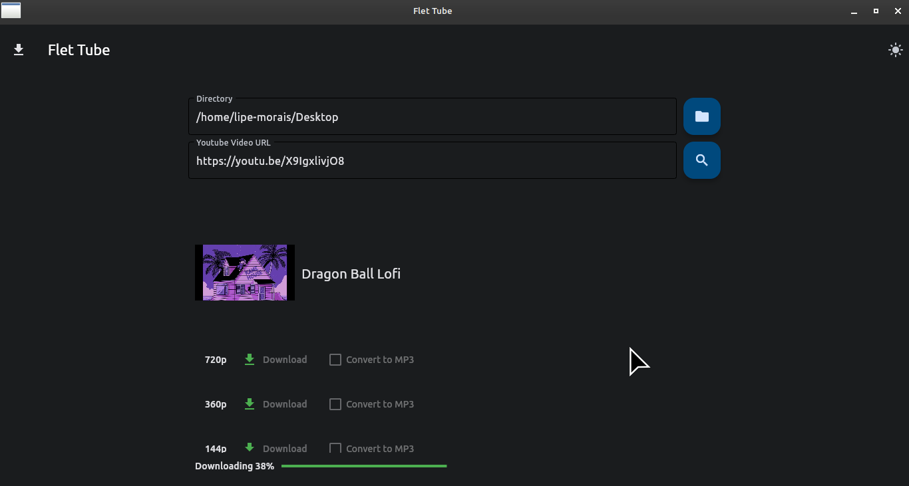

# Flet Tube

Download youtube videos.



## Requirements.
- python3
- nodejs

## Installing.

```bash
python3 -m pip install -r requirements.txt
```

## Running.

```bash
python3 main.py
```
## Inspiration.

[Check here](https://github.com/NeuralNine/youtube-downloader-converter/tree/master) 
